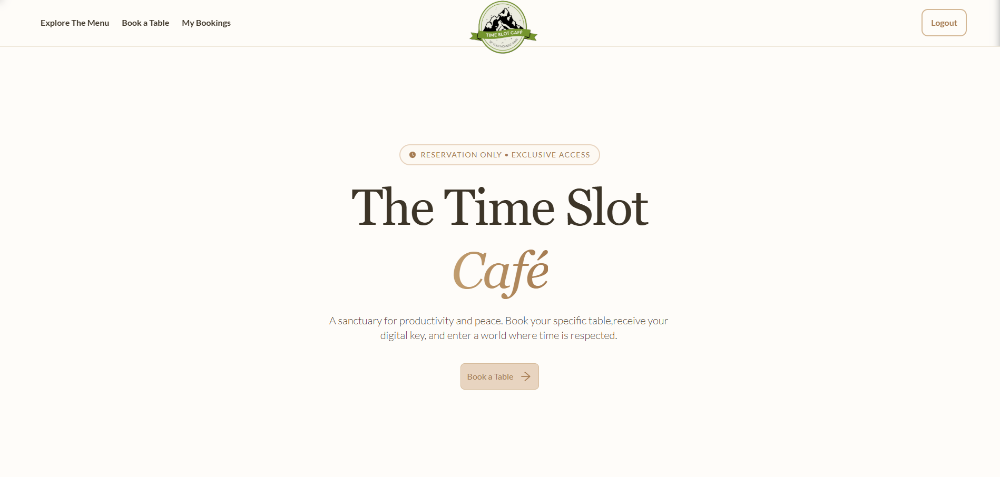
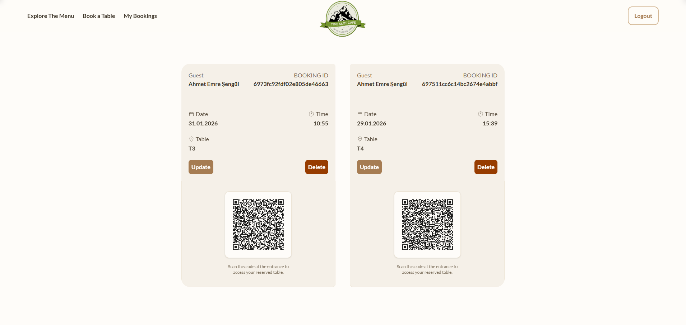
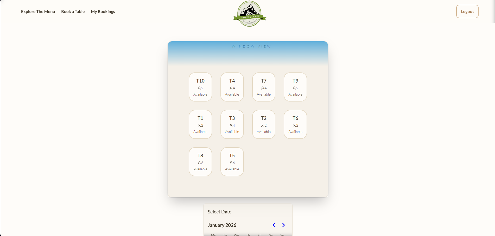

# Time Slot (Coffee Shop Booking) — Fullstack Monorepo

A full-stack platform that lets cafés manage menus and table reservations.
Customers book 4-hour time slots and receive QR codes for fast, contactless entry.



This repo contains a **React (Vite) frontend** and an **Express + MongoDB backend** for a coffee shop site that supports:

- Browsing a coffee menu (static JSON)
- User authentication (email/password + Google OAuth)
- Table booking with overlap checks
- Booking confirmation emails
- Booking QR code generation
- Basic request protection (bot detection + rate limiting)

---



## Repo structure

- `frontend/`: Vite + React + TypeScript SPA
- `backend/`: Express API + MongoDB (Mongoose)

In production, the backend can also **serve the built frontend** (`frontend/dist`) from the same server.

---

## Tech stack & key decisions

### Frontend

- **Vite + React 19 + TypeScript**: fast dev server, typed UI code.
- **React Router** (`react-router-dom`): client-side routing.
- **Zustand**: lightweight state management for auth + booking + coffee listing.
- **Axios**: API calls with `withCredentials: true` so cookie-based auth works.
- **Tailwind CSS v4** + **daisyUI** (+ `tailwind-merge`, `clsx`): utility-first styling and component-friendly class composition.
- **Framer Motion**: UI animations (page sections, booking card carousel, etc.).
- **React Toastify**: user notifications.
- **Radix UI Popover**: used for popovers (e.g., date/time UI).
- **date-fns**: date formatting.

### Backend

- **Express 5** API server.
- **MongoDB + Mongoose**: persistence for Users, Tables, Bookings.
- **JWT stored in an HttpOnly cookie**: backend sets `jwt` cookie on login/signup; frontend doesn’t store tokens in localStorage.
- **Passport Google OAuth 2.0**: Google login flow; successful callback sets cookie then redirects to frontend.
- **Arcjet** (`@arcjet/node`, `@arcjet/inspect`) middleware: shield + bot detection + sliding window rate limiting applied to `/auth/*` and `/book/*`.
- **Brevo (Sendinblue)** (`@getbrevo/brevo`): sends booking confirmation emails.
- **qrcode**: server-side QR code generation for a booking.
- **bcryptjs**: password hashing.
- **cors + cookie-parser**: cross-origin cookies & request parsing.

---

## How it’s implemented (high-level)

### Authentication

- **Local auth**
  - `POST /auth/signup`: validates input, hashes password, creates user, sets `jwt` cookie.
  - `POST /auth/login`: verifies password, sets `jwt` cookie.
  - `POST /auth/logout`: clears `jwt` cookie.
  - `GET /auth/check`: protected route; returns current user if cookie is valid.
  - Middleware: `backend/src/middleware/auth.middleware.js` reads `req.cookies.jwt` and attaches `req.user`.

- **Google OAuth**
  - `GET /auth/google`: starts OAuth flow via Passport.
  - `GET /auth/google/callback`: Passport callback; sets cookie and redirects to `CLIENT_URL/auth/google/success`.
  - Frontend page `/auth/google/success` calls `checkAuth()` to hydrate the user, then routes home.

### Booking flow



- **Tables**
  - `GET /book/available-tables`: returns tables from MongoDB.
  - `backend/src/scripts/seedTables.js`: seeds 10 tables (run via `npm run table` in `backend/`).

- **Create booking (with overlap prevention)**
  - `POST /book/createBooking` (protected):
    - Validates start/end time.
    - Ensures table exists and is `active`.
    - Rejects overlapping bookings for the same table using a time-range query.
    - Generates a random `qrToken`, stores booking, sends confirmation email.

- **Update booking**
  - `PUT /book/updateBooking/:id` (protected):
    - Validates new time, checks overlaps (excluding the booking being updated), then saves.

- **List bookings**
  - `GET /book/my-bookings` (protected): returns current user’s future bookings (end time >= now).
  - `GET /book/table-bookings/:id` (protected): returns future booking ranges for a table (used to show disabled slots).

- **Cancel booking**
  - `DELETE /book/cancelBooking/:id` (protected): deletes booking by id.

- **QR code**
  - `GET /book/bookingQR/:id`: returns a QR image (data URL) containing JSON payload with booking id + token + time range.

### Request protection (Arcjet)

Both `backend/src/routes/auth.route.js` and `backend/src/routes/booking.route.js` apply `arcjetProtection` to all routes.
Rules include:

- Shield: general protections
- Bot detection: blocks bots except allowed categories
- Sliding window rate limit: 100 requests / 60 seconds

---

## Environment variables

Create `backend/.env`:

```env
PORT=3000
NODE_ENV=development
CLIENT_URL=http://localhost:5173

MONGO_URI=mongodb://127.0.0.1:27017/timeslot
JWT_SECRET=change_me

ARCJET_KEY=...
ARCJET_ENV=...

GOOGLE_CLIENT_ID=...
GOOGLE_CLIENT_SECRET=...
GOOGLE_CALLBACK_URL=http://localhost:3000/auth/google/callback

BREVO_API_KEY=...
```

Notes:

- `CLIENT_URL` must match the frontend origin for CORS + OAuth redirects.
- If you use Google OAuth, configure the Google console OAuth redirect URL to match `GOOGLE_CALLBACK_URL`.

---

## Running locally

### Backend

```bash
cd backend
npm install
npm run table   # optional: seed tables
npm run dev
```

Backend runs on `http://localhost:3000`.

### Frontend

```bash
cd frontend
npm install
npm run dev
```

Frontend runs on `http://localhost:5173`.

---

## Deployment model (current code)

- Backend supports serving the built frontend in production:
  - When `NODE_ENV === "production"`, Express serves `../frontend/dist`.
  - Typical flow: build frontend, deploy backend with `frontend/dist` present.

---

## API quick reference

### Auth

- `POST /auth/signup`
- `POST /auth/login`
- `POST /auth/logout`
- `PUT /auth/update-profile` (cookie auth)
- `GET /auth/check` (cookie auth)
- `GET /auth/google`
- `GET /auth/google/callback`

### Booking

- `GET /book/available-tables`
- `POST /book/createBooking` (cookie auth)
- `PUT /book/updateBooking/:id` (cookie auth)
- `GET /book/bookingQR/:id`
- `GET /book/my-bookings` (cookie auth)
- `GET /book/table-bookings/:id` (cookie auth)
- `DELETE /book/cancelBooking/:id` (cookie auth)

---

## Known limitations

### Security & correctness

- **Cookie settings vs local dev**: cookie uses `sameSite: "strict"`. This is OK for same-site usage, but cross-site deployments may require `sameSite: "none"` + `secure: true` and HTTPS.
- **Arcjet in dev**: Arcjet protection is applied to auth/booking routes even in development; misconfigured keys can cause unexpected denials.
- **QR token not verified anywhere**: QR payload includes `qrToken`, but there is no “check-in/verify QR” endpoint implemented.

### Frontend / configuration

- **Hardcoded production URL**: frontend’s Axios baseURL uses a hardcoded production host in multiple places (`frontend/src/lib/axios.ts`, login/signup Google button logic), rather than an env-driven config.
- **No API typing contract**: frontend types are local interfaces; there is no shared schema/OpenAPI.

### Operational / maintenance

- **No tests** (unit/integration/e2e).
- **No containerization** (no Docker config).
- **No migrations**: Mongo schema changes are manual.
- **Email template contains a hardcoded link** to the production domain.

---
