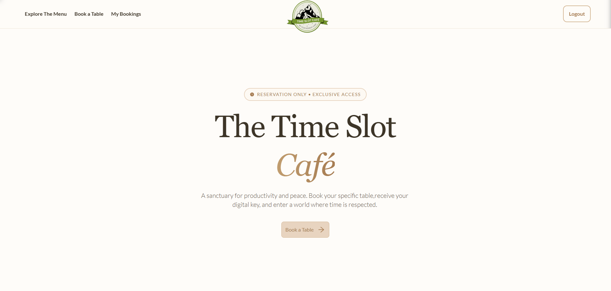
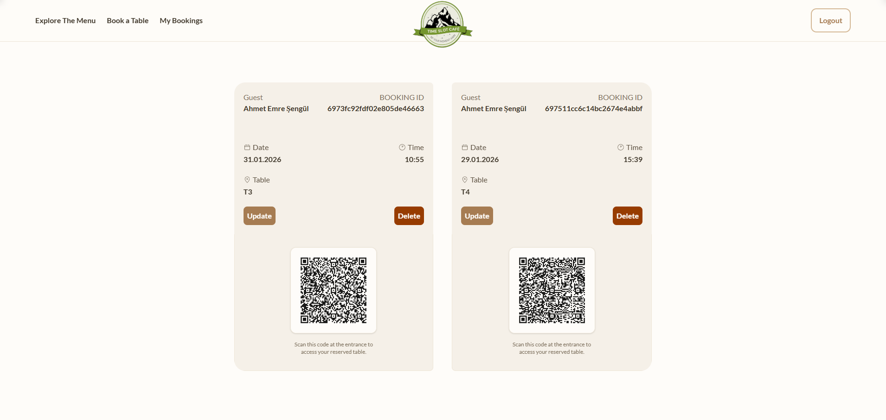
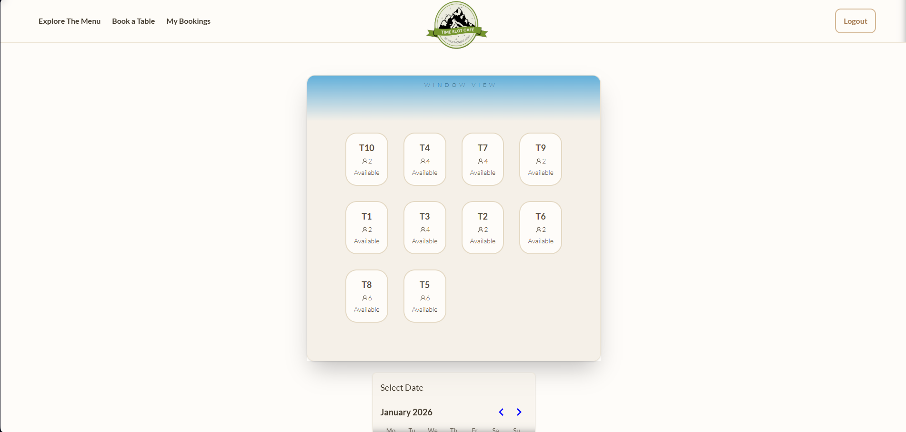

# Time Slot (Coffee Shop Booking) — Fullstack Monorepo

A full-stack platform that lets cafés manage menus and table reservations.
Customers book 4-hour time slots and receive QR codes for fast, contactless entry.



This repo contains a **React (Vite) frontend** and an **Express + MongoDB backend** for a coffee shop site that supports:

- Browsing a coffee menu (from MongoDB)
- Shopping cart with persistent storage (localStorage)
- Stripe payment processing for coffee orders
- Order management and order history
- User authentication (email/password + Google OAuth)
- Table booking with overlap checks
- Booking confirmation emails
- Booking QR code generation
- Basic request protection (bot detection + rate limiting)
- Admin coffee menu management (add, edit, delete coffees)

---



## Repo structure

- `frontend/`: Vite + React + TypeScript SPA
- `backend/`: Express API + MongoDB (Mongoose)

In production, the backend can also **serve the built frontend** (`frontend/dist`) from the same server.

---

## Tech stack & key decisions

### Frontend

- **Vite + React 19 + TypeScript**: fast dev server, typed UI code.
- **React Router** (`react-router-dom`): client-side routing.
- **Zustand**: lightweight state management for auth + booking + coffee listing + cart + orders.
- **Axios**: API calls with `withCredentials: true` so cookie-based auth works.
- **Tailwind CSS v4** + **daisyUI** (+ `tailwind-merge`, `clsx`): utility-first styling and component-friendly class composition.
- **Framer Motion**: UI animations (page sections, booking card carousel, etc.).
- **React Toastify**: user notifications.
- **Skeleton loaders**: loading states for coffee grid and table cards (`CoffeDisplaySkeleton`, `TableCardSkeleton`).
- **Radix UI Popover**: used for popovers where needed.
- **react-day-picker**: date selection for table booking (next 7 days).
- **@stripe/react-stripe-js** + **@stripe/stripe-js**: Stripe payment integration with card elements.
- **date-fns**: date formatting.
- **Playwright**: end-to-end browser tests.

### Backend

- **Express 5** API server.
- **MongoDB + Mongoose**: persistence for Users, Tables, Bookings.
- **JWT stored in an HttpOnly cookie**: backend sets `jwt` cookie on login/signup; frontend doesn’t store tokens in localStorage.
- **Passport Google OAuth 2.0**: Google login flow; successful callback sets cookie then redirects to frontend.
- **Arcjet** (`@arcjet/node`, `@arcjet/inspect`) middleware: shield + bot detection + sliding window rate limiting applied to `/auth/*` and `/book/*`.
- **Brevo (Sendinblue)** (`@getbrevo/brevo`): sends booking confirmation emails.
- **Stripe** (`stripe`): payment processing for coffee orders (Payment Intents API).
- **qrcode**: server-side QR code generation for a booking.
- **bcryptjs**: password hashing.
- **cors + cookie-parser**: cross-origin cookies & request parsing.
- **Jest + SuperTest**: backend integration tests for API routes.

---

## How it’s implemented (high-level)

### Authentication

- **Local auth**
  - `POST /auth/signup`: validates input, hashes password, creates user, sets `jwt` cookie.
  - `POST /auth/login`: verifies password, sets `jwt` cookie.
  - `POST /auth/logout`: clears `jwt` cookie.
  - `GET /auth/check`: protected route; returns current user if cookie is valid.
  - Middleware: `backend/src/middleware/auth.middleware.js` reads `req.cookies.jwt` and attaches `req.user`.

- **Google OAuth**
  - `GET /auth/google`: starts OAuth flow via Passport.
  - `GET /auth/google/callback`: Passport callback; sets cookie and redirects to `CLIENT_URL/auth/google/success`.
  - Frontend page `/auth/google/success` calls `checkAuth()` to hydrate the user, then routes home.

### Coffee menu & shopping cart

- **Coffee listing**
  - `GET /coffee`: fetches all coffees from MongoDB (Coffee model).
  - Frontend: `useCoffeeStore` manages coffee state with pagination support.
  - Coffee cards display image, title, description, price, and cart controls.

- **Cart functionality**
  - Zustand store (`useCartStore`) with `persist` middleware stores cart in localStorage.
  - Cart operations: `addToCart()`, `removeFromCart()`, `increaseQty()`, `decreaseQty()`, `clearCart()`.
  - Quantity limits: max 10 per item, items removed when quantity reaches 0.
  - Cart page (`/cart`) displays items with quantity controls and total price.
  - Cart icon in navbar shows item count.

### Payment & order flow

- **Checkout process**
  1. User adds coffees to cart from menu page.
  2. Cart page shows items, quantities, and total price.
  3. User fills Stripe card form (CardNumber, Expiry, CVC elements).
  4. On submit: `POST /stripe/create-payment-intent` creates Payment Intent with cart items.
  5. Backend calculates total from MongoDB coffee prices (validates items exist).
  6. Frontend confirms payment via `stripe.confirmCardPayment()`.
  7. On success: `POST /orders/create-order` creates order record.
  8. Order number generated (format: `ORD-XXXXXX`).
  9. Cart cleared, user redirected to checkout success page.

- **Order history**
  - `GET /orders/past-orders`: fetches all user orders sorted by date.
  - Order history page displays orders with expandable details.
  - "Order Again" button repopulates cart with previous order items.

### Booking flow



- **Tables**
  - `GET /book/available-tables`: returns tables from MongoDB.
  - `backend/src/scripts/seedTables.js`: seeds 10 tables (run via `npm run table` in `backend/`).

- **Coffee menu (admin)**
  - Admins can add, edit, and delete coffees from the menu via the admin dashboard.
  - `GET /admin/coffee/:id`: get a single coffee by id (admin).
  - `POST /admin/addCoffee`: create a new coffee (admin; body: title, type, price, image, description).
  - `PUT /admin/editCoffee/:id`: update a coffee (admin).
  - `DELETE /admin/deleteCoffee/:id`: delete a coffee (admin).
  - Optional seeding: `backend/src/scripts/seedCoffees.js` reads `backend/src/data/coffee.json` and populates the Coffee collection (run with `node src/scripts/seedCoffees.js` from `backend/`).

- **Create booking (with overlap prevention)**
  - `POST /book/createBooking` (protected):
    - Validates start/end time.
    - Ensures table exists and is `active`.
    - Rejects overlapping bookings for the same table using a time-range query.
    - Generates a random `qrToken`, stores booking, sends confirmation email.

- **Update booking**
  - `PUT /book/updateBooking/:id` (protected):
    - Validates new time, checks overlaps (excluding the booking being updated), then saves.

- **List bookings**
  - `GET /book/my-bookings` (protected): returns current user’s future bookings (end time >= now).
  - `GET /book/table-bookings/:id` (protected): returns future booking ranges for a table (used to show disabled slots).

- **Cancel booking**
  - `DELETE /book/cancelBooking/:id` (protected): deletes booking by id.

- **QR code & check-in**
  - `GET /book/bookingQR/:id`: returns a QR image (data URL) containing JSON payload with booking id + token + time range.
  - Booking documents include a `qrToken` and a `checkedIn` flag; QR codes are verified via `POST /admin/verifyBooking` from the admin dashboard, which marks valid bookings as checked in within a grace window.

### Shopping cart & payments

- **Cart management**
  - Frontend: Zustand store (`useCartStore`) with localStorage persistence for cart state.
  - Users can add coffees to cart, adjust quantities (max 10 per item), and remove items.
  - Cart persists across browser sessions.

- **Stripe payment flow**
  - `POST /stripe/create-payment-intent` (protected): creates a Stripe Payment Intent from cart items, calculates total from MongoDB coffee prices, returns `clientSecret`.
  - Frontend: `CheckoutForm` component uses Stripe Elements (CardNumber, CardExpiry, CardCvc) to collect payment details.
  - Payment is confirmed via `stripe.confirmCardPayment()` with the client secret.
  - Currency: TRY (Turkish Lira).

- **Order management**
  - `POST /orders/create-order` (protected): creates an order with orderItems, totalPrice, and generates an order number (format: `ORD-XXXXXX`).
  - `GET /orders/past-orders` (protected): returns all past orders for the current user, sorted by creation date (newest first).
  - `GET /orders/last-order` (protected): returns the most recent order for the current user.
  - After successful payment, order is created and cart is cleared.
  - Frontend: Order history page displays past orders with "Order Again" functionality.

- **Coffee menu**
  - `GET /coffee`: returns all coffees from MongoDB (replaces static JSON).

### Request protection (Arcjet)

Both `backend/src/routes/auth.route.js` and `backend/src/routes/booking.route.js` apply `arcjetProtection` to all routes.
Rules include:

- Shield: general protections
- Bot detection: blocks bots except allowed categories
- Sliding window rate limit: 100 requests / 60 seconds

### Admin & moderation

- **Roles & access control**
  - Users have a `role` field (`"user"` or `"admin"`) and an `isBanned` flag.
  - Backend middleware `isAdmin` ensures only admins can access `/admin/*` routes.
  - Middleware `isBanned` blocks banned users from creating bookings, paying, or creating orders (booking, Stripe, and order routes apply this guard).

- **Admin dashboard (frontend)**
  - Admin-only routes: `/admin` (dashboard), `/admin/:id` (per-user activity), and `/admin/coffees` (manage menu) are only accessible if `authUser.role === "admin"`.
  - `/admin` shows:
    - A QR scanner (HTML5 QR) that reads booking QR codes and triggers verification.
    - A list of non-admin users with their ban status, an "Activity" link, and a "Ban/Unban" toggle button.
    - A "Manage Coffees" link to the coffee management page.
  - `/admin/:id` shows:
    - The selected user's order history with line items, totals, and timestamps.
    - The selected user's bookings with checked-in status and booking time ranges.
  - `/admin/coffees` shows:
    - Full CRUD for the coffee menu: add new coffee, edit existing (title, type, price, image, description), and delete. Uses `AdminCoffeForm` and `useAdminStore` (addCoffee, editCoffee, deleteCoffee).

- **QR check-in flow**
  - Staff opens the admin dashboard and scans the booking QR code.
  - The frontend sends `bookingId` and `token` from the QR payload to `POST /admin/verifyBooking`.
  - The backend verifies the token, ensures the booking exists, and checks that the current time is within the allowed window (30 minutes before to 60 minutes after the booking).
  - On success, the booking's `checkedIn` flag is set to `true` and the response includes basic user and table information for confirmation.

---

## Environment variables

Create `backend/.env`:

```env
PORT=3000
NODE_ENV=development
CLIENT_URL=http://localhost:5173

MONGO_URI=mongodb://127.0.0.1:27017/timeslot
JWT_SECRET=change_me

ARCJET_KEY=...
ARCJET_ENV=...

GOOGLE_CLIENT_ID=...
GOOGLE_CLIENT_SECRET=...
GOOGLE_CALLBACK_URL=http://localhost:3000/auth/google/callback

BREVO_API_KEY=...

STRIPE_SECRET_KEY=...
```

Frontend environment variables (create `frontend/.env`):

```env
VITE_STRIPE_PUBLISHABLE_KEY=...
E2E_ADMIN_EMAIL=...
E2E_ADMIN_PASSWORD=...
```

Notes:

- `CLIENT_URL` must match the frontend origin for CORS + OAuth redirects.
- If you use Google OAuth, configure the Google console OAuth redirect URL to match `GOOGLE_CALLBACK_URL`.

---

## Running locally

### Backend

```bash
cd backend
npm install
npm run table   # optional: seed tables
# optional: seed coffees (from backend dir): node src/scripts/seedCoffees.js
npm run dev
```

Backend runs on `http://localhost:3000`.

### Frontend

```bash
cd frontend
npm install
npm run dev
```

Frontend runs on `http://localhost:5173`.

---

## Deployment model (current code)

- Backend supports serving the built frontend in production:
  - When `NODE_ENV === "production"`, Express serves `../frontend/dist`.
  - Typical flow: build frontend, deploy backend with `frontend/dist` present.

---

## Integration Testing

The backend is covered by an integration test suite built with **Jest** (native ESM) and **Supertest**, exercising every controller through real HTTP requests against a real Express app instance — auth included via actual JWT cookies through the `protectRoute` middleware, not mocked.

### Approach

Each controller was first tested manually (structured test cases: happy path, edge cases, error cases) before being automated. This surfaced and fixed several real bugs, including missing ownership checks, unhandled crashes from missing fields, incorrect `ObjectId` validation ordering, and sensitive fields (password hash) leaking in API responses.

### Coverage

| Suite | Flows covered |
|---|---|
| `admin.controller.test.js` | Admin-only access control, view all users, ban/unban a user, view a booking's check-in QR verification (including time-window and already-checked-in logic), view a user's orders |
| `auth.controller.test.js` | Signup, login, logout |
| `booking.controller.test.js` | Create, view, update, and cancel a table booking — including validation (missing fields, invalid dates, invalid/inactive table, overlapping time slots), ownership checks, and unauthorized access |
| `coffee.controller.test.js` | Fetch coffee menu items |
| `order.controller.test.js` | Create an order, view past orders, view last order, delete an order — including quantity validation and unauthorized/ownership checks |
| `stripe.controller.test.js` | Payment intent creation with correct amount calculation, empty cart validation |
| `table.controller.test.js` | Fetch available tables, fetch a table's bookings, fetch available time slots for a table — including invalid/inactive/not-found table handling |


### Running the tests

```bash
cd backend
npm test              # run the full suite
npm test -- --verbose # list every test case individually
npm test -- --coverage
```

## E2E Testing

End-to-end coverage is provided by **Playwright**, driving a real browser against the running app (frontend + backend + a real Stripe test-mode integration) to verify complete user flows exactly as a real user would experience them.

### Approach

Unlike the backend integration tests (which run in isolation against an in-memory database), these tests exercise the full stack together — real login, real navigation, real Stripe Elements iframe for payment, and real admin actions — to catch issues that only appear when frontend, backend, and third-party services interact.

### Coverage

| Suite | Flows covered |
|---|---|
| `auth.spec.ts` | Signup, login, logout |
| `booking.spec.ts` | Create, view, update, and cancel a table booking |
| `order.spec.ts` | Browse menu, add to cart, checkout with Stripe, view order history, reorder, delete an order |
| `admin.spec.ts` | Admin login, view all users, view a user's orders/bookings, ban/unban a user, add/edit/delete a coffee item |

### Running the tests

```bash
cd frontend
npx playwright test              # run the full suite
npx playwright test --ui         # interactive mode
npx playwright test admin.spec.ts # run a single suite
```

Requires the backend and frontend dev servers running locally, plus a seeded test user and admin account (see `.env.example` for the required `E2E_ADMIN_EMAIL` / `E2E_ADMIN_PASSWORD` variables). Payment flows use Stripe's test card (`4242 4242 4242 4242`).

## API quick reference

### Auth

- `POST /auth/signup`
- `POST /auth/login`
- `POST /auth/logout`
- `PUT /auth/update-profile` (cookie auth)
- `GET /auth/check` (cookie auth)
- `GET /auth/google`
- `GET /auth/google/callback`

### Booking

- `GET /book/available-tables`
- `POST /book/createBooking` (cookie auth)
- `PUT /book/updateBooking/:id` (cookie auth)
- `GET /book/bookingQR/:id`
- `GET /book/my-bookings` (cookie auth)
- `GET /book/table-bookings/:id` (cookie auth)
- `DELETE /book/cancelBooking/:id` (cookie auth)

### Admin

- `GET /admin/allUsers` (cookie auth + admin): list all non-admin users with basic info.
- `GET /admin/userBookings/:id` (cookie auth + admin): get all bookings for a specific user.
- `GET /admin/userOrders/:id` (cookie auth + admin): get all orders for a specific user.
- `POST /admin/banUser/:id` (cookie auth + admin): toggle a user's `isBanned` status.
- `POST /admin/verifyBooking` (cookie auth + admin): verify a booking QR token and mark the booking as checked in.
- `GET /admin/coffee/:id` (cookie auth + admin): get a single coffee by id.
- `POST /admin/addCoffee` (cookie auth + admin): add a new coffee (body: title, type, price, image, description).
- `PUT /admin/editCoffee/:id` (cookie auth + admin): edit a coffee.
- `DELETE /admin/deleteCoffee/:id` (cookie auth + admin): delete a coffee.

### Coffee & Orders

- `GET /coffee`: get all coffees
- `POST /stripe/create-payment-intent` (cookie auth): create Stripe payment intent
- `POST /orders/create-order` (cookie auth): create order after payment
- `GET /orders/past-orders` (cookie auth): get user's order history
- `GET /orders/last-order` (cookie auth): get user's most recent order

---

## Known limitations

### Security & correctness

- **Cookie settings vs local dev**: cookie uses `sameSite: "strict"`. This is OK for same-site usage, but cross-site deployments may require `sameSite: "none"` + `secure: true` and HTTPS.
- **Arcjet in dev**: Arcjet protection is applied to auth/booking routes even in development; misconfigured keys can cause unexpected denials.
- **No audit log for admin actions**: banning/unbanning users and manual check-ins are not logged anywhere beyond the current database state.

### Frontend / configuration

- **No API typing contract**: frontend types are local interfaces; there is no shared schema/OpenAPI.
- **Stripe test mode**: payment processing uses Stripe test environment; test card `4242 4242 4242 4242` can be used for testing.

### Operational / maintenance

- **No containerization** (no Docker config).
- **No migrations**: Mongo schema changes are manual.
- **Email template contains a hardcoded link** to the production domain.

---
